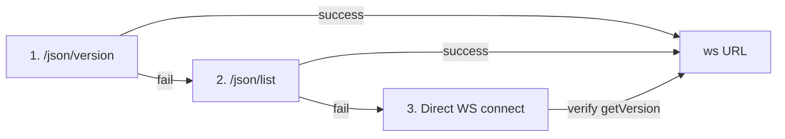

# Agent Browser CDP Protocol Layer

## Module Structure

The `native/cdp/` submodule implements the Chrome DevTools Protocol (CDP) communication layer — typed command/event types, WebSocket client, endpoint discovery, and Chrome/Lightpanda process management.

```
native/cdp/
├── mod.rs        — Module root declaring submodules
├── client.rs     — WebSocket CDP client (~361 lines)
├── types.rs      — Protocol type definitions (~586 lines + auto-generated)
├── discovery.rs  — CDP endpoint discovery (~387 lines)
├── chrome.rs     — Chrome process management (~1960 lines)
└── lightpanda.rs — Lightpanda process management (~495 lines)
```

## CdpClient — WebSocket Protocol Client

The `CdpClient` is the primary interface to a browser's CDP endpoint. It manages a WebSocket connection, command/response correlation, event broadcasting, and connection keepalive.

### Key Structs

- **`CdpClient`** — Holds:
  - `ws_tx: Arc<Mutex<SplitSink<...>>>` — WebSocket write sink (shared for inspect proxy)
  - `next_id: AtomicU64` — Monotonically increasing command ID generator
  - `pending: PendingMap` — HashMap of `u64 → oneshot::Sender<Value>` for response tracking
  - `event_tx: broadcast::Sender<CdpEvent>` — Typed event broadcast (256 capacity)
  - `raw_tx: broadcast::Sender<RawCdpMessage>` — Raw message broadcast for inspect proxy
  - `_reader_handle` / `_keepalive_handle` — Background task JoinHandles

- **`InspectProxyHandle`** — Lightweight cloneable handle with `ws_tx` + `raw_tx` for bidirectional DevTools proxy forwarding.

- **`RawCdpMessage`** — `{text: String, session_id: Option<String>}` for raw message broadcast.

### Connection & Keepalive

- **`connect(url)`** / **`connect_with_headers(url, headers)`** — Connects to a CDP WebSocket URL, sets TCP `SO_KEEPALIVE` (30s idle, 10s interval via `socket2`), spawns reader loop and keepalive loop.
- **Background reader loop** — Parses incoming WebSocket messages:
  - If has `id` → route to pending oneshot channel (response)
  - If has `method` → broadcast as `CdpEvent` + broadcast raw text
  - Handles `Text` and `Binary` frames
- **Background keepalive loop** — Sends WebSocket `Ping` frames every 30 seconds. Stops on connection close.

### Command Sending

- **`send_command(method, params, session_id)`** — Sends a CDP command, creates a oneshot channel, inserts into `pending` map, waits for response with **30-second timeout**. Returns `Result<Value, String>`.
- **`send_command_typed<P, R>`** — Typed variant: serializes `P` params, deserializes result into `R`.
- **`send_command_no_params(method)`** — Convenience for commands with no parameters.
- **`send_raw(json)`** — Sends raw JSON without tracking (used by inspect proxy).

### Event Subscription

- **`subscribe()`** — Returns `broadcast::Receiver<CdpEvent>` for typed event listening.
- **`subscribe_raw()`** — Returns `broadcast::Receiver<RawCdpMessage>` for raw message listening.
- **`inspect_handle()`** — Creates an `InspectProxyHandle` for bidirectional forwarding.

## CDP Protocol Types (`types.rs`)

### Core Envelope Types

- **`CdpCommand`** — `{id: u64, method: String, params: Option<Value>, session_id: Option<String>}` — outgoing command.
- **`CdpMessage`** — `{id: Option<u64>, result: Option<Value>, error: Option<CdpError>, method: Option<String>, params: Option<Value>, session_id: Option<String>}` — incoming message.
- **`CdpError`** — `{code: i64, message: String, data: Option<String>}` — error response.
- **`CdpEvent`** — `{method: String, params: Value, session_id: Option<String>}` — event notification.

### Domain-Specific Types

**Target Domain:**
- `TargetInfo` — `{target_id, type, title, url, attached, browser_context_id, opener_id}`
- `GetTargetsResult` — `{target_infos: Vec<TargetInfo>}`
- `AttachToTargetParams/Result` — `{target_id, flatten} → {session_id}`
- `SetDiscoverTargetsParams` — `{discover}`
- `CreateTargetParams/Result` — `{url, width, height, new_window, background} → {target_id}`
- `CloseTargetParams` — `{target_id}`
- Events: `TargetCreatedEvent`, `TargetDestroyedEvent`, `TargetInfoChangedEvent`

**Page Domain:**
- `PageNavigateParams/Result` — `{url, referrer, transition_type, frame_id} → {frame_id, loader_id, error_text}`
- `FrameNavigatedEvent` — `{frame: FrameInfo}`
- `FrameInfo` — `{id, parent_id, loader_id, name, url, domain_and_registry, security_origins}`
- `JavascriptDialogOpeningEvent` — `{type, message, url, has_browser_handler, default_prompt}`
- `HandleJavaScriptDialogParams` — `{accept, prompt_text}`

**Runtime Domain:**
- `EvaluateParams/Result` — `{expression, object_id, include_command_line_api, return_by_value, await_promise, user_gesture} → {result: RemoteObject, exception_details}`
- `RemoteObject` — `{type, subtype, class_name, value, description, object_id, preview}`
- `ExceptionDetails` — `{exception_id, text, line_number, column_number, exception, script_id, stack_trace}`
- Events: `ConsoleApiCalledEvent`, `ExceptionThrownEvent`

**Accessibility Domain:**
- `GetFullAXTreeResult` — `{nodes: Vec<AXNode>}`
- `AXNode` — `{node_id, role, name, value, properties: Vec<AXProperty>, child_ids, backend_node_id}`
- `AXValue` — `{type, value}`
- `AXProperty` — `{name, value: AXValue}`

**DOM Domain:**
- `DomResolveNodeParams/Result`, `DomGetBoxModelParams/Result`, `BoxModel`, `DomQuerySelectorParams/Result`, `DomGetDocumentParams/Result`, `DomNode`

**Input Domain:**
- `DispatchMouseEventParams` — `{type, x, y, button, buttons, click_count, delta_x, delta_y, modifiers}`
- `DispatchKeyEventParams` — `{type, key, code, text, windows_virtual_key_code, native_virtual_key_code, modifiers}`
- `InsertTextParams` — `{text}`

**Screenshot:**
- `CaptureScreenshotParams/Result` — `{format, quality, clip, from_surface, capture_beyond_viewport} → {data}`
- `Viewport` — `{x, y, width, height, scale}`

**Runtime Call:**
- `CallFunctionOnParams` — `{function_declaration, object_id, arguments: Vec<CallArgument>, return_by_value, await_promise}`
- `CallArgument` — `{object_id, value}`

**Network Domain:**
- `RequestWillBeSentEvent`, `NetworkRequest`, `LoadingFinishedEvent`, `LoadingFailedEvent`

**BrowserVersionInfo** — `{web_socket_debugger_url, browser, version, user_agent}` — from `/json/version`.

### Lightpanda Compatibility

The `string_or_int` and `opt_vec_string_or_int` custom serde deserializers handle a difference between Chrome and Lightpanda:
- **Chrome** sends node IDs as strings (e.g., `"node-123"`)
- **Lightpanda** sends node IDs as numbers (e.g., `123`)

These deserializers accept both formats transparently.

### Auto-Generated Types (`build.rs`)

The `build.rs` script reads `cdp-protocol/browser_protocol.json` and `cdp-protocol/js_protocol.json` and generates Rust type definitions for all CDP domains, commands, events, and type definitions. Generated code is included via `include!` from `OUT_DIR`.

**Code generation flow:**
1. `ensure_dashboard_dir()` — creates the dashboard placeholder directory
2. Reads and parses both protocol JSON files
3. For each domain: `generate_domain()` produces a Rust module with:
   - PascalCase type names from `domain.name + type.id`
   - Command structs with `Params` and `Result` variants
   - Event structs
   - Property mapping with `resolve_ref()` for cross-domain references
   - Snake_case field names with `to_snake_case()`
   - Rust keyword collision avoidance via `is_rust_keyword()`

## CDP Endpoint Discovery (`discovery.rs`)

The discovery module implements a three-method cascade for finding CDP WebSocket URLs from a running browser:



### Key Functions

- **`discover_cdp_url(host, port, query)`** / **`discover_cdp_url_with_timeout(...)`** — Three-method cascade with configurable timeout.
- **`fetch_cdp_info(host, port)`** — GET `http://{host}:{port}/json/version`, parse `BrowserVersionInfo`, extract `webSocketDebuggerUrl`.
- **`fetch_cdp_list(host, port)`** — GET `http://{host}:{port}/json/list`, find browser-type target with `webSocketDebuggerUrl`.
- **`discover_cdp_ws(host, port, query)`** — Direct WebSocket connect to `ws://{host}:{port}/devtools/browser`, verify with `Browser.getVersion`.
- **`rewrite_ws_host(url, host, port)`** — Rewrites host/port in WebSocket URL. Handles Chrome returning `127.0.0.1` when browser is remote.
- **`append_query(url, query)`** — Preserves user-supplied URL query parameters (e.g., `?mode=Hello`).
- **`bracket_ipv6(addr)`** — Wraps IPv6 addresses in brackets for URL formatting.

## Chrome Process Management (`chrome.rs`)

The largest file in the CDP module (~1960 lines). Manages Chrome binary discovery, launch, argument construction, profile management, and CDP endpoint detection.

### Key Structs

- **`ChromeProcess`** — Wraps a `Child` process with:
  - `ws_url: String` — Discovered CDP WebSocket URL
  - `temp_user_data_dir: Option<PathBuf>` — Temporary profile directory (cleaned on `Drop`)
  - `pgid: Option<i32>` (Unix only) — Process group ID for group kill
  - Methods: `kill()`, `has_exited()`, `wait_or_kill(timeout)`, `id()`
  - `Drop` impl: kills process, cleans temp profile directory

- **`LaunchOptions`** — Extensive configuration:
  - `headless`, `executable_path`, `proxy/bypass/username/password`
  - `profile`, `args`, `allow_file_access`, `extensions`, `storage_state`
  - `user_agent`, `ignore_https_errors`, `color_scheme`
  - `download_path`, `viewport_size`, `use_real_keychain`

- **`ChromeArgs`** — Internal: `{args: Vec<String>, user_data_dir: Option<PathBuf>, temp_user_data_dir: Option<PathBuf>}`

### Chrome Binary Discovery (`find_chrome`)

Multi-source search in priority order:
1. `AGENT_BROWSER_EXECUTABLE_PATH` env var
2. Puppeteer/Playwright bundled Chromium cache (`~/.cache/puppeteer/`, `~/.cache/ms-playwright/`)
3. Platform-specific standard installations (Linux: `/usr/bin/google-chrome*`, macOS: `/Applications/Google Chrome.app`, Windows: `Program Files`)
4. PATH lookup (`which`/`where`)

### Chrome Launch Flow (`launch_chrome`)

1. Resolve profile: `resolve_chrome_profile` maps profile names to directories
2. Copy profile to temp dir if needed: `copy_chrome_profile` (excludes Cache, Code Cache, Service Worker, etc.)
3. Build Chrome arguments: `build_chrome_args` — constructs full CLI args including:
   - `--remote-debugging-port=0` (auto-assign)
   - `--no-first-run`, `--disable-default-apps`
   - Headless mode: `--headless=new` (unless extensions loaded)
   - Proxy settings: `--proxy-server`, `--proxy-bypass-list`
   - Window size, extensions, sandbox/shm flags
4. Spawn Chrome process
5. Wait for CDP endpoint: read `DevToolsActivePort` file or discover via stderr output
6. **Retry up to 3 times** on launch failure

### Sandbox & Container Detection

- **`should_disable_sandbox()`** — Detects CI (`CI=true`, `GITHUB_ACTIONS`), root user, Docker/Podman environments → adds `--no-sandbox`
- **`should_disable_dev_shm()`** — Detects small `/dev/shm` (< 64MB) or Docker → adds `--disable-dev-shm-usage`

### Profile Management

- **`list_chrome_profiles()`** — Reads Chrome's `Local State` JSON, parses profile entries
- **`resolve_chrome_profile()`** — Three-tier: exact directory → display name → case-insensitive
- **`copy_chrome_profile()`** — Copies to temp dir, excludes large non-essential directories (Cache, Code Cache, GPUCache, Service Worker, etc.)

## Lightpanda Process Management (`lightpanda.rs`)

Lightpanda is a lightweight headless browser alternative to Chrome. This module manages its lifecycle.

### Key Structs

- **`LightpandaProcess`** — `{child: Child, ws_url: String, _log_drainers: Vec<JoinHandle>}`. `Drop` impl kills the process.
- **`LightpandaLaunchOptions`** — `{executable_path, proxy, port}` (all Optional, Default).
- **`LaunchLogBuffer`** — Bounded (40 lines) stdout/stderr capture. Thread-safe via `Arc<Mutex<VecDeque<String>>>`.

### Launch Flow (`launch_lightpanda`)

1. Find binary: `find_lightpanda()` — searches PATH, `which`/`where`, home directory candidates
2. Allocate port: uses specified port or random port (0 → OS assigns)
3. Spawn process: `lightpanda serve --host 127.0.0.1 --port N --timeout 604800` (1-week max session)
4. Start log drainer threads: bounded capture of stdout/stderr
5. Wait for CDP readiness: `wait_for_lightpanda_ready` — polls CDP discovery until ready
6. On failure: surfaces process exit status and captured log output

### Limitations

Lightpanda does not support:
- Extensions (`--extension`)
- Chrome profiles (`--profile`)
- Storage state files (`--storage-state`)
- Headed mode (`--headed`)
- Custom Chrome args (`--args`)