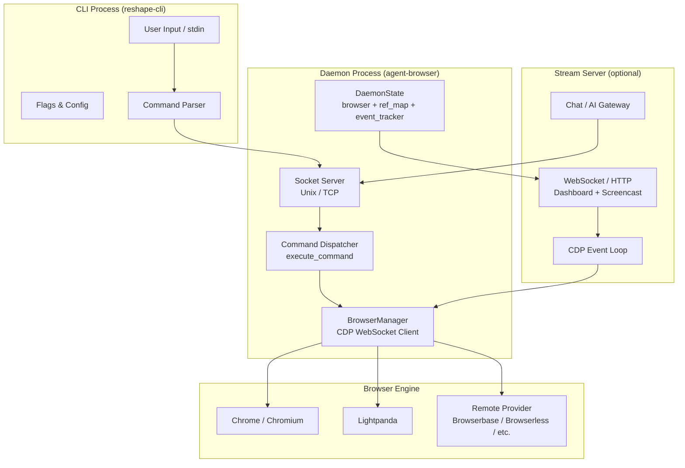

# Agent Browser Overview

## Crate Identity

`agent-browser` is a vendored copy of [`vercel-labs/agent-browser`](https://github.com/vercel-labs/agent-browser) version `0.27.0`, specifically the upstream `cli/` crate. It provides fast browser automation via Chrome DevTools Protocol (CDP) for AI agents.

- **Package name:** `agent-browser`
- **Version:** `0.27.0`
- **Edition:** Rust 2021
- **License:** Apache-2.0
- **Repository:** <https://github.com/vercel-labs/agent-browser>

The crate was vendored into this workspace to enable in-process browser control without requiring an external binary installation. Local additions (`src/lib.rs`, `src/facade.rs`, `tests/facade_protocol.rs`) provide a small Rust API for reshape integration while keeping the upstream CLI intact.

## Architecture

### Three-Process Architecture

The system operates across up to three processes:

1. **CLI process** — Parses user input, constructs JSON commands, sends them over Unix socket/TCP to the daemon.
2. **Daemon process** — Holds the long-lived browser session. Receives commands, dispatches to handler functions, communicates with the browser via CDP WebSocket. Can run embedded (in-process) via `AGENT_BROWSER_EMBEDDED_DAEMON=1`.
3. **Browser process** — Chrome, Lightpanda, or a remote cloud browser. The daemon connects via CDP WebSocket and sends protocol commands.

### Communication Model

- **CLI → Daemon:** JSON-over-socket. Each command is a newline-delimited JSON object with `id`, `action`, and action-specific fields. Responses are newline-delimited JSON with `success`, `data`, `error`, `warning`.
- **Daemon → Browser:** CDP WebSocket protocol. Typed command/response via `CdpClient` with oneshot-channel response tracking and 30-second timeouts.
- **Daemon → Dashboard:** WebSocket + HTTP on a separate port. Broadcasts screencast frames, status, console logs, errors, and tab changes.

## Module Map

| Module | File | Role |
|--------|------|------|
| `lib` | `src/lib.rs` | Library target — declares modules and exports facade types |
| `facade` | `src/facade.rs` | Local Rust API — `BrowserSession`, `BrowserOptions`, command builders, daemon startup |
| `commands` | `src/commands.rs` | CLI argument → JSON command parser (~5000 lines + ~2400 lines of tests) |
| `connection` | `src/connection.rs` | Daemon IPC — Unix/TCP transport, session inventory, daemon startup (`ensure_daemon`), command send with retry |
| `chat` | `src/chat.rs` | Interactive AI chat mode — single-turn and multi-turn conversation with LLM gateway |
| `flags` | `src/flags.rs` | CLI flag parsing and config file loading — `Config` and `Flags` structs |
| `output` | `src/output.rs` | Response rendering — text/JSON output, help text, version, snapshot/screenshot diff formatting |
| `validation` | `src/validation.rs` | Session name validation — alphanumeric + hyphens + underscores |
| `color` | `src/color.rs` | Terminal color utilities — `NO_COLOR` spec compliance, `AGENT_BROWSER_COLOR` toggle |
| `install` | `src/install.rs` | Chrome binary download and installation — Chrome for Testing CDN, Linux dependency setup |
| `upgrade` | `src/upgrade.rs` | Self-upgrade — auto-detect install method (npm/pnpm/yarn/bun/brew/cargo), fetch latest version |
| `skills` | `src/skills.rs` | Skill discovery and listing — Markdown frontmatter-based skill metadata |
| `main` | `src/main.rs` | CLI entry point — command routing, daemon startup, proxy validation, batch execution |
| `native` | `src/native/` | Browser engine implementation — the core subsystem (see below) |
| `doctor` | `src/doctor/` | Diagnostic subsystem — installation health checks with optional `--fix` repair |
| `test_utils` | `src/test_utils.rs` | Test isolation — `ENV_MUTEX`, `EnvGuard` RAII for environment variable safety |

### Native Submodule Map

| Module | File | Role |
|--------|------|------|
| `browser` | `native/browser.rs` | Browser lifecycle — launch, connect, navigate, tab management, viewport, network idle |
| `actions` | `native/actions.rs` | Command dispatcher + daemon state — `DaemonState`, `execute_command`, all action handlers |
| `daemon` | `native/daemon.rs` | In-process daemon — socket server, connection handler, idle timeout |
| `cdp` | `native/cdp/` | CDP protocol layer — client, types, discovery, chrome/lightpanda process management |
| `element` | `native/element.rs` | Element resolution — ref/selector → CDP coordinates, property queries |
| `snapshot` | `native/snapshot.rs` | Accessibility tree snapshot — AI-friendly page representation with refs |
| `screenshot` | `native/screenshot.rs` | Screenshot capture — with annotation overlays matching snapshot refs |
| `interaction` | `native/interaction.rs` | Browser interaction primitives — click, type, scroll, key press, touch |
| `state` | `native/state.rs` | Browser state persistence — cookies + localStorage/sessionStorage, AES-256-GCM encryption |
| `auth` | `native/auth.rs` | Encrypted credential storage — AES-256-GCM, Node.js-compatible JSON envelope |
| `network` | `native/network.rs` | Network control — domain filter, headers, offline, console/error event tracking |
| `policy` | `native/policy.rs` | Action policy — allow/deny/confirm lists, hot-reloadable policy files |
| `providers` | `native/providers.rs` | Remote browser providers — Browserbase, Browserless, Browser Use, Kernel, AgentCore (AWS) |
| `cookies` | `native/cookies.rs` | Cookie management via CDP `Network.*` |
| `storage` | `native/storage.rs` | Web Storage access via CDP `Runtime.evaluate` |
| `recording` | `native/recording.rs` | Session recording — CDP screenshot → ffmpeg MP4/WebM pipe |
| `tracing` | `native/tracing.rs` | CDP tracing & CPU profiling — `Tracing.start/end`, stream reading |
| `diff` | `native/diff.rs` | Visual/text diff — pixel-level screenshot comparison, Myers diff for snapshots |
| `react` | `native/react/` | React introspection — tree, renders, suspense, vitals, scripts |
| `stream` | `native/stream/` | Real-time streaming — WebSocket/HTTP server, screencast, dashboard, chat |
| `inspect_server` | `native/inspect_server.rs` | DevTools frontend proxy — bidirectional CDP message proxying |
| `webdriver` | `native/webdriver/` | WebDriver backend — Safari/iOS via Appium, SafariDriver, xcrun simctl |

## Key Dependencies

| Dependency | Purpose |
|------------|---------|
| `tokio` | Async runtime, I/O, channels, process spawning |
| `reqwest` | HTTP client for provider APIs, version checks, Chrome download |
| `serde` / `serde_json` | JSON serialization for protocol, config, tool args |
| `tokio-tungstenite` | CDP WebSocket client |
| `image` | Screenshot processing, pixel-level diff |
| `similar` | Myers diff algorithm for snapshot comparison |
| `rust-embed` | Embedded dashboard UI assets |
| `aes-gcm` / `sha2` / `hmac` | AES-256-GCM encryption for state and auth |
| `chrono` / `uuid` | Timestamps and message IDs |
| `base64` | CDP screenshot data, encryption envelope encoding |
| `socket2` | TCP keepalive for CDP WebSocket connections |
| `zip` | Chrome for Testing archive extraction |
| `dirs` | Home/cache/config directory resolution |
| `notify` | (Not used in this crate — used in reshape-core workspace) |
| `libc` / `windows-sys` | Platform-specific process management (pgid kill, PID detection) |

## Vendored Source Policy

The crate follows a strict vendoring policy documented in `VENDORED.md`:

- **Upstream files** are copied intact and should not be edited unless unavoidable.
- **Local additions** are in separate files: `src/lib.rs`, `src/facade.rs`, `tests/facade_protocol.rs`, `VENDORED.md`.
- **Local upstream-file adjustments** are minimal and documented:
  - `build.rs` — dashboard path from `../packages/dashboard/out` to `packages/dashboard/out`
  - `src/native/stream/http.rs` — same dashboard asset path adjustment
  - `src/native/daemon.rs` — embedded library mode skips Unix stderr FD redirection
  - `Cargo.toml` — workspace-managed dependency versions and release profiles

When updating upstream:
1. Replace copied portions from new `cli/` source.
2. Reapply documented additive files.
3. Update `VENDORED.md` with the new version.
4. Run `cargo test -p agent-browser` and dependent crate tests.

## Browser Engine Support

| Engine | Connection | Key Features |
|--------|------------|-------------|
| **Chrome / Chromium** | Local CDP WebSocket | Full CDP support, extensions, profiles, headed mode, custom args |
| **Lightpanda** | Local CDP WebSocket | Lightweight alternative, limited features (no extensions/profiles) |
| **Browserbase** | Remote API → CDP WS URL | Cloud browser, `BROWSERBASE_API_KEY` |
| **Browserless** | Remote API → CDP WS URL | Cloud browser with stealth, TTL, `BROWSERLESS_API_KEY` |
| **Browser Use** | Remote API → CDP WS URL | Cloud browser, `BROWSER_USE_API_KEY` |
| **Kernel** | Remote API → CDP WS URL | Cloud browser with stealth/timeout, `KERNEL_API_KEY` |
| **AgentCore (AWS)** | AWS SigV4-signed API → CDP WS URL | Bedrock browser, AWS credentials |
| **Safari (macOS)** | SafariDriver → WebDriver | Limited features via `safaridriver` |
| **iOS (Appium)** | Appium → WebDriver | XCUITest + Safari on simulators/devices |

Engine selection: `AGENT_BROWSER_ENGINE=lightpanda` for Lightpanda, default is Chrome. Provider selection: `AGENT_BROWSER_PROVIDER=browserbase|browserless|browseruse|kernel|agentcore|ios`.

## Security Boundaries

### Encryption

- **State files** and **auth profiles** use AES-256-GCM encryption with SHA256-hashed keys and random 12-byte IVs.
- **Key sources:** `AGENT_BROWSER_ENCRYPTION_KEY` (64-char hex) or `~/.agent-browser/.encryption-key` (auto-generated with `0o600` permissions).
- **Node.js compatibility:** JSON envelope format `{version:1, encrypted:true, iv, authTag, data}` enables cross-language profile sharing.

### Action Policy

- Declarative `allow/deny/confirm` lists loaded from JSON files (`AGENT_BROWSER_ACTION_POLICY`).
- Precedence: **deny > confirm > allow**.
- `RequiresConfirmation` triggers interactive `y/N` prompts for sensitive actions.
- Hot-reloadable: `ActionPolicy::reload()` re-reads the file without restarting the daemon.

### Domain Filter

- `DomainFilter` restricts navigation and WebSocket connections to allowed domains.
- Supports wildcard patterns (`*.example.com`).
- Dual enforcement: client-side JS patching (WebSocket/EventSource/sendBeacon) + server-side CDP `Fetch.enable` interception.
- Blocked pages are navigated to `about:blank`.

### Session Name Validation

- Only alphanumeric, hyphens, and underscores (`is_valid_session_name`).
- Prevents path traversal and injection in socket/pid file paths.

### Socket/Stream Origin Restriction

- Stream server only accepts connections from `localhost`, `127.0.0.1`, `::1`, or `file://` origins.
- Dashboard same-origin validation for WebSocket and HTTP requests.

## Filesystem Artifacts

The daemon creates sidecar files per session in the socket directory:

| File | Content | Purpose |
|------|---------|---------|
| `{session}.sock` | Unix domain socket | CLI → daemon IPC (Unix only) |
| `{session}.pid` | Process ID | Daemon process liveness check |
| `{session}.version` | CLI version string | Version mismatch detection on reconnect |
| `{session}.port` | TCP port number | CLI → daemon IPC (Windows / TCP mode) |
| `{session}.stream` | Stream server port | Dashboard/screencast port |
| `{session}.engine` | Engine name | Chrome/Lightpanda metadata |
| `{session}.provider` | Provider name | Remote provider metadata |
| `{session}.extensions` | Extension list | Loaded Chrome extensions |
| `dashboard.pid` | Dashboard server PID | Dashboard liveness |

All paths are resolved through `get_socket_dir()` with `AGENT_BROWSER_SOCKET_DIR` override support.