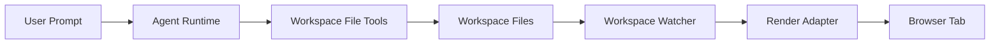

# Browser Render Pipeline Design

## Purpose

The render pipeline displays workspace files that the agent creates or edits. The agent produces files; browser control is a separate adapter that observes file changes and refreshes or injects content.

## Data Flow

## Rendering Modes

- Full reload: reload the current local HTML file after a workspace change.
- Targeted injection: use CDP to update DOM or CSS without full reload when the adapter can prove the target page matches the changed file.
- Manual preview: print the changed path and let the user open it manually when no browser is connected.

## Change Policy

- Agent writes trigger workspace change events.
- Watcher does not automatically create new agent turns, preventing feedback loops.
- Render adapter may debounce changes before refreshing the browser.

## Approval Boundaries

Generated page assets inside the workspace can refresh automatically. Actions that navigate away from the local preview, submit forms, download remote resources, or execute browser-side destructive actions should require explicit user confirmation.

## Future Extension

The render adapter can later become a `Tool` if the agent needs to ask the browser for screenshots, layout measurements, or render validation. The first implementation should keep it outside the agent tool loop.
